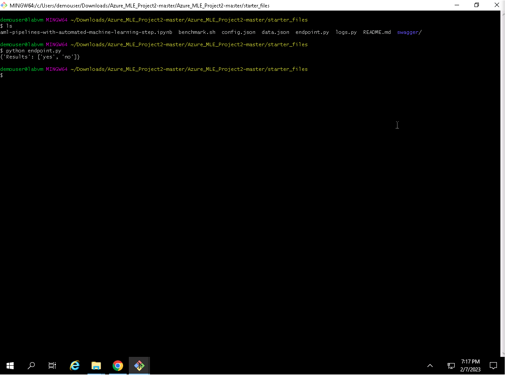
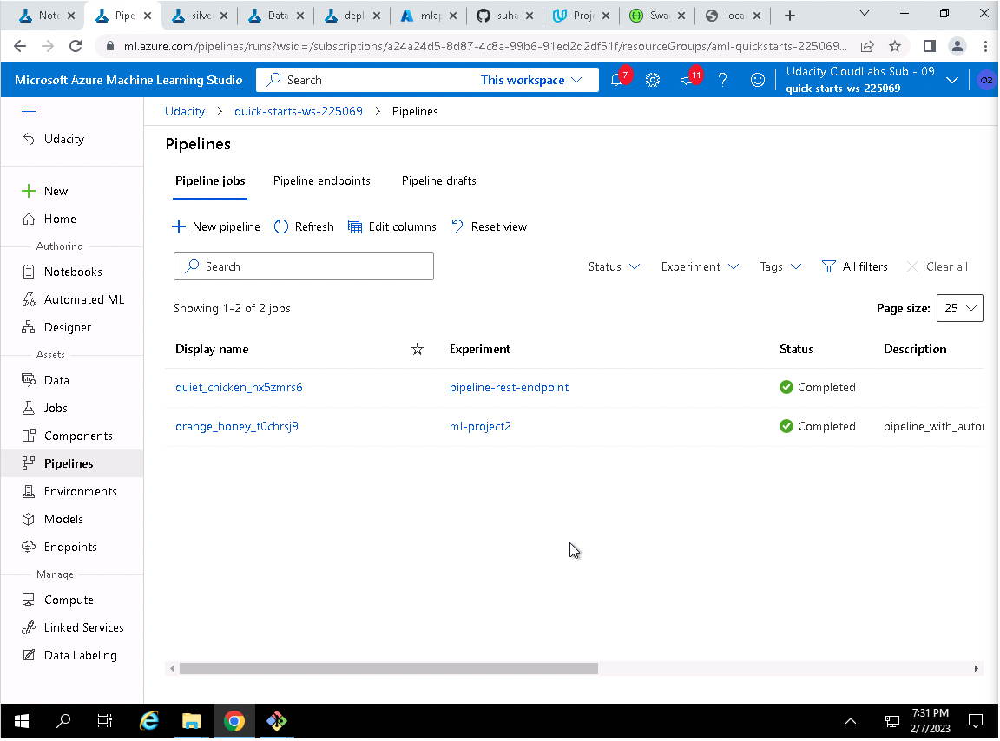
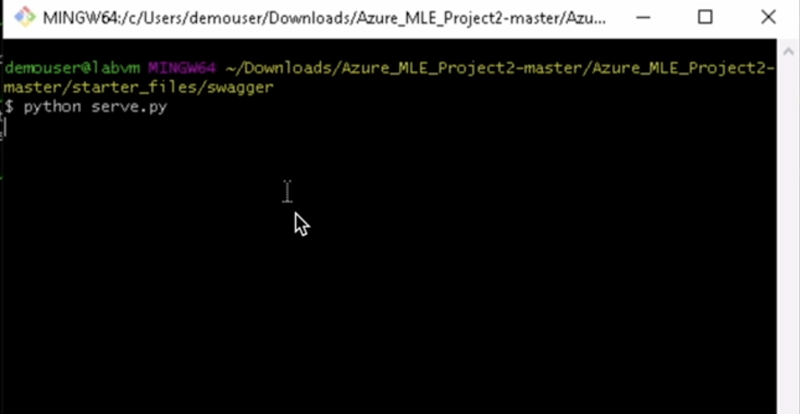

# Operationalizing Machine Learning

## Overview
In this project which is a part of the Azure ML Engineer Nanodegree, we continued to work with the Bank Marketing dataset.
We used Azure to configure a cloud-based machine learning production model, deploy it, and consume it. We also learned 
to create, publish, and consume a pipeline.

## Architectural Diagram
*Figure 1: Architectural Diagram*

## Key Steps
**1. Authentication :** 

I skipped this step as I am using the lab Udacity account.

**2. Automated ML Experiment :** 

I configured a compute cluster (Standard_DS3_v2), registered the bank marketing dataset
and set up and ran an Automated ML experiment (best-model). This experiment identified VotingEnsemble to be the best 
model with a weighted AUC of 0.95. 

*Figure 2: Registered Dataset*

As can be seen in the figure, the *bankmarketing_train.csv* was successfully uploaded as a registered dataset named 
*bank-marketing*.

*Figure 4: Experiment Completion*

As can be seen in the figure the AutoML experiment called best-model has completed in about 18 mins and the VotingEnsemble
was the best model found.

*Figure 5: AutoML Models*

The figure shows all the models evaluated by the AutoML experiment and their corresponding weighted AUCs.

*Figure 6: Best AutoML Model Metrics*

The figure shows the metrics for the best model (VotingEnsemble). 

**3. Deploy the best model :** 

I deployed the best model using Azure Container Instance (ACI) with authentication enabled. 

*Figure 7: Model Deployment*

The figure shows the settings used to deploy the model.

**4. Enable logging :**

I created a virtual conda environment and installed the Python SDK for Azure.
I edited and ran the provided *logs.py* to enable logging. This helped monitor the deployed model and keep track of the
request frequency, latency, etc.

*Figure 8: Application Insights Enabled*

The figure shows the model endpoint page which has been updated to reflect that application insights are now enabled.

*Figure 9: Running Logs*

The figure shows the endpoint logs running in the terminal.

**5. Swagger Documentation :**

I downloaded *swagger.json* and ran both *swagger.sh* and *serve.py*. I interacted
with the swagger instance running with the documentation for the HTTP API for the model.

*Figure 10: Serving Swagger Directory*

The figure shows the swagger directory is being served with *serve.py*.

*Figure 11: Swagger UI Container*

The figure shows the running docker container which was built on the swagger-ui image.

*Figure 12: Swagger API*

The figure shows the Swagger API page for the required model deployment endpoint.

**6. Consume model endpoints :**

I successfully demonstrated the model was consumable by modifying and running *endpoint.py*. I also demonstrated I 
could consume the model using Postman.

*Figure 13: Consume Model*

The figure shows the model is returning predictions when the updated *endpoint.py* is run. This demonstrates the model can be 
consumed by posting a JSON to the endpoint and supplying the required authentication.

*Figure 14: Consume Model Via Postman*

The figure shows the model is consumable by using the *Postman* desktop application.

**7. Create and publish a pipeline :** 

I uploaded and updated the jupyter notebook provided to match the environment. I 
demonstrated it was running successfully.

*Figure 15: Pipeline Running*

The figure shows the pipeline has been submitted from the Jupyter notebook and is now running with information available in ML studio. 

*Figure 16: Pipeline Completion Notebook*

The figure shows the pipeline run has completed in the Jupyter notebook.

*Figure 16: Pipeline Completion*

The figure shows the pipeline has completed as shown in ML studio.

*Figure 16: Published Pipeline*

The figure shows the published pipeline in ML studio.

*Figure 16: Published Pipeline Endpoint*

The figure shows the published pipeline endpoint in ML studio.

** Documentation

## Screen Recording
[https://youtu.be/97uhnickb0M](https://youtu.be/97uhnickb0M)

